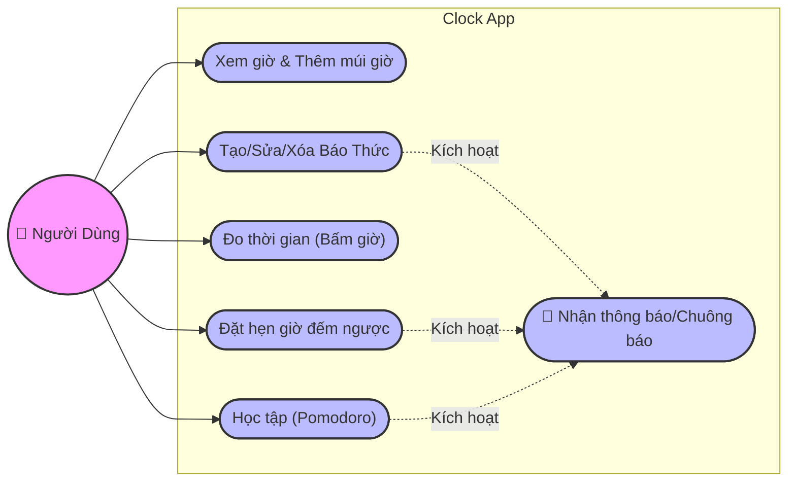
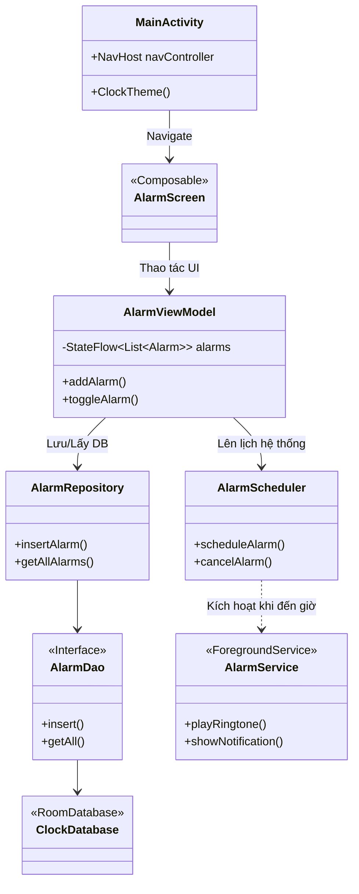
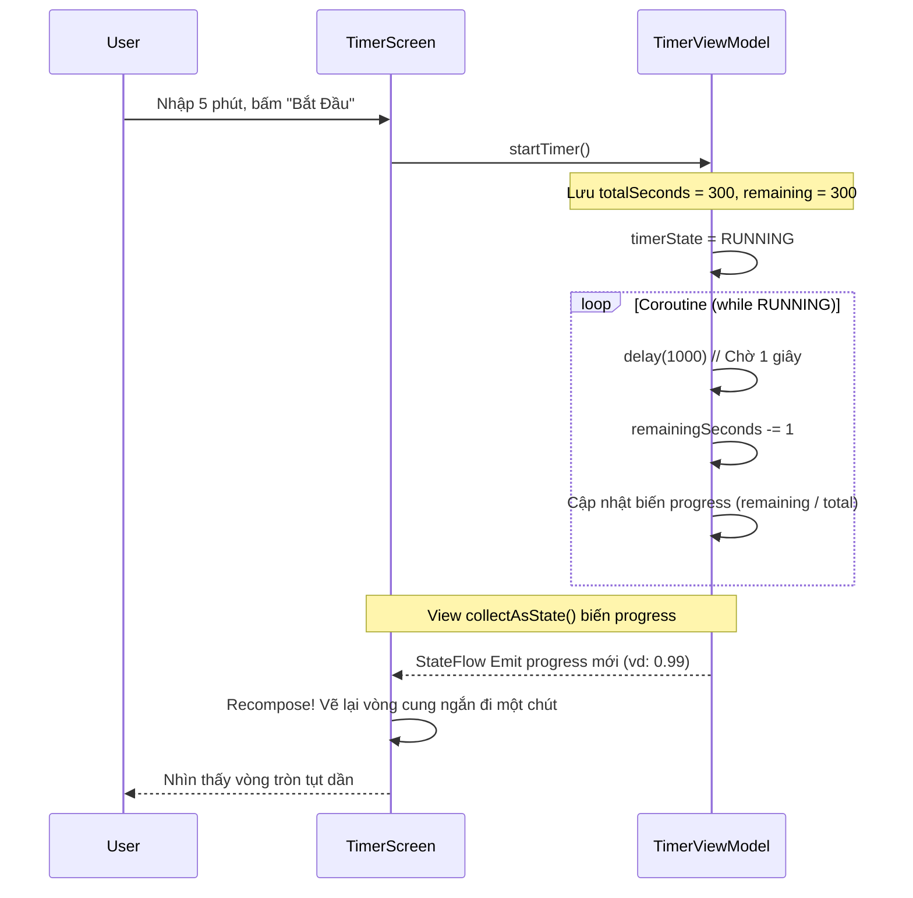

# ChronoClock - Ứng Dụng Đồng Hồ Đa Năng (Android)

Chào mừng bạn đến với **ChronoClock**! Tài liệu này được biên soạn đặc biệt dành cho các lập trình viên Android mới tiếp cận dự án, giúp bạn nắm bắt nhanh chóng toàn bộ cấu trúc, công nghệ và luồng hoạt động của mã nguồn.

---

## 1. Công Nghệ & Kiến Trúc Dự Án (Tech Stack & Architecture)

Dự án được xây dựng theo tiêu chuẩn phát triển Android hiện đại (Modern Android Development - MAD) của Google:

*   **Ngôn ngữ:** Kotlin 100%.
*   **Giao diện (UI):** Jetpack Compose (Declarative UI) thay thế cho XML truyền thống.
*   **Kiến trúc:** **MVVM (Model - View - ViewModel)** kết hợp với **Clean Architecture** (phân lớp logic rõ ràng).
*   **Quản lý State & Bất đồng bộ:**
    *   **Kotlin Coroutines:** Xử lý các tác vụ chạy nền (IO, Database) không chặn UI thread.
    *   **StateFlow / SharedFlow:** Lắng nghe và phản hồi thay đổi dữ liệu theo thời gian thực từ ViewModel sang Compose UI (Reactive Programming).
*   **Lưu trữ Dữ liệu (Local Storage):** Room Database (ORM bọc ngoài SQLite) để lưu cấu hình Báo thức, Đồng hồ thế giới.
*   **Services & Background Tasks:** 
    *   `AlarmManager`: Đặt lịch hệ thống để kích hoạt báo thức ngay cả khi app bị tắt.
    *   `Foreground Service`: Giữ đếm ngược (Timer) và phát nhạc báo thức chạy nền mà không bị hệ thống kill (kèm Notification).
*   **Design Pattern (Mẫu thiết kế):**
    *   *Repository Pattern:* Nơi tập trung lấy/ghi dữ liệu (từ Room DB), tách biệt ViewModel khỏi logic truy xuất dữ liệu.
    *   *Singleton:* (Trong Room Database) Đảm bảo chỉ có 1 kết nối database duy nhất.
    *   *Observer Pattern:* Xuyên suốt nhờ `StateFlow`.

---

## 2. Tính Năng & Hành Vi Người Dùng (Use Case)

Ứng dụng chia làm 5 màn hình chính tương ứng với 5 Module ở `BottomNavigationBar`:

1.  **Đồng hồ (ClockScreen):** Xem giờ hiện tại (Analog + Digital) và danh sách Đồng hồ thế giới.
2.  **Báo thức (AlarmScreen):** Đặt giờ, lặp lại các ngày trong tuần, nhạc chuông, rung.
3.  **Bấm giờ (StopwatchScreen):** Bấm giờ thể thao, đánh dấu các vòng (Lap), tự tìm vòng nhanh/chậm nhất.
4.  **Hẹn giờ (TimerScreen):** Nhập thời lượng (bàn phím số) HOẶC Nhập "Giờ bắt đầu - Giờ kết thúc" → app tự đếm ngược.
5.  **Pomodoro (PomodoroScreen):** Bộ đếm ngược học tập: Focus (25m) -> Nghỉ ngắn (5m) -> Nghỉ dài (15m).

### Biểu đồ Use-Case (Góc nhìn người dùng)



---

## 3. Kiến Trúc Luồng Code (MVVM Structure)

Dự án tuân thủ nghiêm ngặt mô hình **MVVM**. Hãy xem cách dòng dữ liệu (Data Flow) chạy từ lúc người dùng thao tác đến khi lưu vào Database:

1.  **View (Screen.kt):** Giao diện Jetpack Compose. Chỉ nhận thao tác người dùng (click, gõ phím) và hiển thị State. Tuyệt đối *không chứa logic tính toán*.
2.  **ViewModel (.kt):** Nhận Event từ View, xử lý logic (tính toán ngày giờ, validate input), gọi Repository, sau đó cập nhật kết quả vào biến `StateFlow`. View sẽ tự động (reactive) vẽ lại UI khi `StateFlow` thay đổi.
3.  **Repository (.kt):** Quyết định lấy dữ liệu từ đâu (trong dự án này là gọi xuống DAO của Room Database).
4.  **Model/Data (Entity & DAO):** Chứa cấu trúc dữ liệu (`@Entity`) và câu lệnh query SQL (`@Dao`).

### Biểu đồ Lớp Tĩnh (Class Diagram - Tổng quan)



---

## 4. Chi Tiết Luồng Hoạt Động (Sequence Diagrams)

Để hiểu rõ cách multithreading (coroutines) và Android OS giao tiếp với app của chúng ta, hãy phân tích 2 luồng khó nhất trong ứng dụng:

### Luồng 1: Người dùng hẹn Báo Thức (Alarm)

Mục tiêu: Đảm bảo app dù bị đóng hẳn (swipe tắt khỏi đa nhiệm) thì đến giờ vẫn phải đổ chuông.

```mermaid
sequenceDiagram
    actor User
    participant View as AlarmScreen (Compose)
    participant VM as AlarmViewModel
    participant Repo as AlarmRepository
    participant OS as AlarmManager (Android OS)
    participant Receiver as AlarmReceiver

    User->>View: Chỉnh giờ và bấm "Lưu"
    View->>VM: addAlarm(alarm)
    
    rect rgb(30, 40, 50)
        Note right of VM: Coroutine (viewModelScope.launch)
        VM->>Repo: insertAlarm() (Lưu vào Room DB)
        Repo-->>VM: trả về ID mới
        VM->>OS: AlarmScheduler.scheduleAlarm(ID, time)
    end
    
    OS-->>VM: Cài đặt hẹn giờ thành công ở mức OS
    VM-->>View: StateFlow cập nhật danh sách báo thức
    View-->>User: Hiển thị báo thức mới trên màn hình
    
    Note over OS, Receiver: ... App có thể bị tắt đi ...
    
    OS->>Receiver: ĐÚNG GIỜ! Gửi Broadcast Intent
    Receiver->>AlarmService: startForegroundService()
    Note over AlarmService: Hiển thị Notification rung + Chuông!
```



### Luồng 2: Bộ đếm ngược (Timer) với StateFlow

Khi user đang đếm ngược ở `TimerScreen`, tại sao giao diện vòng tròn (Circular Progress) lại chuyển động mượt mà?



---

## 5. Cấu Trúc Thư Mục (Folder Structure)

Bạn có thể tìm file dễ dàng theo cấu trúc gói (package) chuẩn Clean Architecture sau:

```text
com.example.clock
│
├── data/               # Tầng dữ liệu (Local DB)
│   ├── db/             # Room Database setup
│   ├── model/          # Entities (Alarm.kt, TimerPreset.kt)
│   └── repository/     # Repositories gọi DAO
│
├── service/            # Các Service chạy ngầm & OS Receivers
│   ├── AlarmReceiver.kt  # Lắng nghe sự kiện báo thức từ hệ thống
│   ├── BootReceiver.kt   # Cài lại báo thức khi user khởi động lại điện thoại
│   └── TimerService.kt   # Chạy ngầm thông báo hẹn giờ
│
├── ui/                 # Tầng UI (Jetpack Compose)
│   ├── alarm/          # Màn hình & ViewModel Báo thức
│   ├── clock/          # Màn hình Đồng hồ thế giới
│   ├── components/     # Các thành phần tái sử dụng (NumPad, AnalogClock...)
│   ├── pomodoro/       # Logic & UI Pomodoro
│   ├── stopwatch/      # Logic & UI Bấm giờ
│   ├── timer/          # Logic & UI Hẹn giờ
│   └── theme/          # Màu sắc (Light/Dark mode), Font chữ (Orbitron)
│
└── MainActivity.kt     # Entry point, chứa Bottom Navigation & NavHost
```

---

## 6. Hướng Dẫn Dành Cho Dev Mới (Tips)

1.  **Nếu bạn muốn sửa màu sắc/giao diện:** Mở `ui/theme/Theme.kt` và `Color.kt`. App tự động hỗ trợ Light/Dark mode dựa trên cấu hình ở đây.
2.  **Nếu bạn muốn thêm trường dữ liệu cho Báo thức (vd: tên bài hát):** 
    - Thêm vào class `Alarm` trong `data/model`.
    - Build lại project để KSP (Kotlin Symbol Processing) tự động generate lại Room schemas.
3.  **Lỗi vòng lặp vô tận (Recomposition Loop):** Ở Jetpack Compose, không bao giờ gọi các hàm tốn thời gian (như query database hoặc delay) trực tiếp trong block `@Composable`. Hãy đặt nó trong `LaunchedEffect` hoặc gọi qua `ViewModel`.
4.  **Báo thức không kêu khi tắt app (trên máy Xiaomi/Oppo...):** Đây là do hệ điều hành tuỳ biến tự động kill tiến trình. App đã xin quyền `SCHEDULE_EXACT_ALARM`, nếu test trên thiết bị thật, hãy hướng dẫn user cấp quyền "Tự khởi động" (AutoStart) cho ứng dụng.

Chúc bạn code vui vẻ! 🚀
